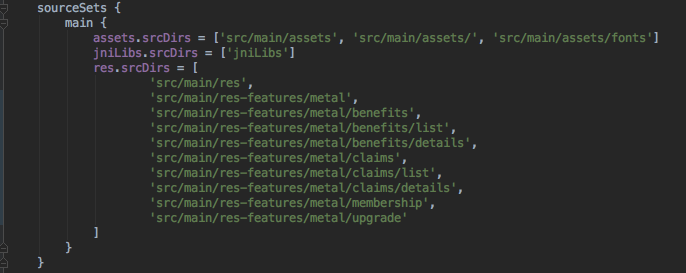

# 使用Gradle和Kotlin组织Android的资源文件

## 前言

如果您已经开发了3年或4年的App应用程序，那么您可能会注意到资源文件夹是如何变得混乱不堪的。尽管大多数开发人员会专注于组织他们的Java / Kotlin文件（通过功能或屏幕），但资源文件通常无人看管。

尝试减少混乱的一个尝试是使用文件的命名约定。例如，在一些使用的布局文件中：

- activity_*.xml
- fragment_*.xml
- item_*.xml

或者：

- feature1_screen1_activity.xml
- feature1_screen2_fragment.xml
- feature2_activity.xml

虽然这确保了Android Studio中的文件列表是相关的，但随着项目的增长，问题仍然存在：大量的（以某种方式排序或命名的）文件。

## 目录

一个不错的方法是实际上按照组织Java / Kotlin文件的逻辑方式组织资源。如果我们有这样的结构：


相应地，资源如下所示：


为了实现这种效果：

- 在AS中切换到项目视图
- 右键点击**主文件夹**并添加一个**目录**。我们将其称为**res-features**。
- 添加功能名称**metal**的另一个目录。
- 最后，为每个屏幕添加尽可能多的目录。

在每个屏幕目录内，添加标准的Android资源文件夹，这些文件夹以前是在原始的**res**文件夹中，比如**layout**，**drawable-xhdpi**，**values** ...

如果有多个屏幕使用资源，请将它们保存在父目录中。例如，metal 特征的字符串被分组到一个文件中，并且其内容被所有的metal 屏幕使用，所以我们将它放在父文件中：


## Gradle 设置

我们需要让Android Studio查找新的目录而不是默认的“res”下来查找资源文件。为此，请转到build.gradle文件并找到对应每个屏幕的**sourceSet**和 目录：



尽管如此，如果项目存在多个module，这还是会变得无比臃肿和丑陋，所以我们可以将其抽取为公用的文件

## 抽取：方法1（所有Gradle）

如果我们将这些目录解压到另一个文件呢？ Gradle可以帮助我们使这看起来更整洁。

- 转到module的根目录。
- 添加新的目录，称之为**resourcessystem**
- 添加新的新文件，在这种情况下，我们将其称为**metalresources.gradle**

```groovy
ext {
    metaldirs = [ "src/main/res-features/metal",
             "src/main/res-features/metal/benefits",
             "src/main/res-features/metal/benefits/list",
             "src/main/res-features/metal/benefits/details",
             "src/main/res-features/metal/claims",
             "src/main/res-features/metal/claims/list",
             "src/main/res-features/metal/claims/details",
             "src/main/res-features/metal/membership",
             "src/main/res-features/metal/upgrade"]
}
```

* 在build.gradle文件中添加:

```groovy
apply from: 'resourcessystem/metalresources.gradle'
def metalResources = rootProject.ext.metaldirs
```

* 最后，在**sourceSets**中

```xml
sourceSets {

    main {
        ....
        res.srcDirs = metalResources
    }
}
```

## 抽取：方法2（Grdle+Kotlin）

更好的方法是将这些目录用单独的Kotlin字符串数组分组。每个数组代表一个功能。

* 在项目根目录添加**buildSrc**目录
* 在**buildSrc**里面添加一个名为**build.gradle.kts**的文件，并在其中启用kotlin插件并进行同步：

```groovy
import org.gradle.kotlin.dsl.`kotlin-dsl`

plugins {
    `kotlin-dsl`
}
```

- 添加目录**src** > **main** > **java>***resources*

内部资源添加一个新的Kotlin对象文件，该文件具有该功能资源的一个数组列表

```kotlin
package resources

object Metal {

    val dirs = arrayListOf(
        "src/main/res-features/metal",
        "src/main/res-features/metal/benefits",
        "src/main/res-features/metal/benefits/list",
        "src/main/res-features/metal/benefits/details",
        "src/main/res-features/metal/claims",
        "src/main/res-features/metal/claims/list",
        "src/main/res-features/metal/claims/details",
        "src/main/res-features/metal/membership"
    )
}
```

> 对每个功能执行相同的操作以保持文件的精简和相关性

- 在**build.gradle中**，引用每个文件的所有**目录**来替换目录

```
import resources.*
sourceSets { 
         .....
        res.srcDirs = Metal.dirs + Savings.dirs + Insurance.dirs
    }
}
```

## 最后

* 你可以添加一个**res-common**目录给所有通用的layout是，drawables，values…它与res-features具有相同的级别
* 如果您打算通过功能模块化您的项目，这种方法实际上是一个好的开始。当您开始模块化时，您只需将每个功能文件夹复制到模块中。

[原文链接](https://proandroiddev.com/organising-android-resources-with-gradle-and-kotlin-26df1413d7ff)

