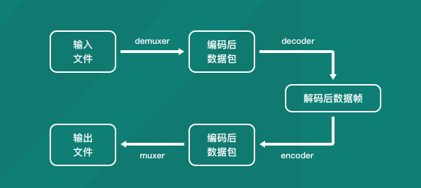

# FFmpeg-公司技术分享

## 什么是FFmpeg

github地址：[https://github.com/FFmpeg/FFmpeg](https://github.com/FFmpeg/FFmpeg)

FFmpeg官网：[https://ffmpeg.org/](https://ffmpeg.org/)

`FFmpeg`是一套可以用来做音视频`采集`，`裁剪`,`转换`，`推流`等操作的`开源计算机程序`。采用LGPL或GPL许可证，它提供了录制、转换以及流化音视频的完整解决方案。

国内耳熟能详的`暴风影音`、`QQ影音`，以及国外著名的`KMPlayer`、`PotPlayer`，都采用了FFmpeg的代码但却不按规矩开源，被放入了FFmpeg的耻辱名单当中。

## FFmpeg主要组成组件

* `ffmpeg`：一个命令行工具，用来对视频，音频文件执行`剪辑`，`转换格式`，`旋转`，`添加滤镜`等操作的指令集
* `ffserver`：一个HTTP多媒体即时广播流服务器，支持回溯
* `ffplay`：一个简单的播放器，基于SDL与FFmpeg库
* `libavcodec`：包含全部FFmpeg音频/视频编解码库
* `libavformat`：包含demuxers和muxer封装格式库
* `libavutil`：ffmpeg一个工具库
* `libavfilter`：加filter的库(这里翻译成滤镜不太严谨)
* `libswscale`：对图像做转换比例(缩放)的库
* `libavresample`：做重采样的库
* `libavdevice`：使用这个库可以读取电脑（或者其他设备上）的多媒体设备的数据，或者输出数据到指定的多媒体设备上

## FFmpeg命令集的常用参数

FFmpeg可使用众多参数，参数内容会根据ffmpeg版本而有差异，使用前建议先参考参数及编解码器的叙述。

也可以使用`ffmpeng -h`命令查看

### 常用参数

* `-i`：设置输入源，可以是文件，也可以是网络流文件
* `-f`：设置输出格式
* `-y`：若输出文件已经存在就覆盖
* `-fs`：超过指定的文件的持续时间就结束
* `-ss`：从指定时间开始，一般格式为`00:00:00`，也可以是`多少秒`
* `-t`：指令的持续时间
* `-title`：设置媒体文件的标题
* `-c`：指定输出文件的编码
* `-metadata`：更改输出文件的`元数据`

### 影像参数

- `-b:v`——设置影像流量，默认为200Kbit/秒。
- `-r`——设置帧率值，默认为25。
- `-s`——设置画面的宽与高。
- `-aspect`——设置画面的比例。
- `-vn`——不处理影像，于仅针对声音做处理时使用。
- `-vcodec( -c:v )`——设置影像影像编解码器，未设置时则使用与输入文件相同之编解码器。

### 声音参数

- `-b:a`——设置每个`Channel`的流量（chanel可以理解为声道数，左声道，右声道这种）
- `-ar`——设置采样率。
- `-ac`——设置声音的`Channel`数。
- `-acodec ( -c:a )` ——设置声音编解码器，未设置时与影像相同，使用与输入文件相同之编解码器。
- `-an`——不处理声音，于仅针对影像做处理时使用。
- `-vol`——设置音量大小，256为标准音量。（要设置成两倍音量时则输入512，依此类推。）

## 常用命令

### 查看媒体信息

```shell
ffprobe xxx.xx
ffmpeg -i xxx.xx
```

### 播放媒体文件

```shell
ffplay xxxx.文件格式

ffplay xxx.mp4
```

### 下载网络媒体到本地

```shell
ffmpeg -i http://file.52lishi.com/file/yinxiao/ly-17-12-16-06.mp3 laosiji.aac
```

### 转换媒体格式

```shell
ffmpeg -i 源媒体 输出媒体
```

```shell
ffmpeg -i chailao.mp4 chailao.ts
```

`.ts`：TS是 transport Stream的缩写通常称为码流文件, TS文件是最e原始的音频视频容器,没有经过其他算法的压缩所以一般会很大,这跟当时播放的源文件的情况,比如比特率什么的.

### 裁剪媒体文件

```shell
ffmpeg -i 源媒体 -ss 00:00:20 -t 10 -c copy 输出媒体
```

```shell
ffmpeg -i chailao.mp4 -ss 00:02:08 -t 7 -c copy chailao_split.mp4
```

`-c`：也就是`codec`(编码)，`copy`指定和源媒体使用同样的配置(元数据)

### 视频转gif

```shell
ffmpeg -i 源媒体 xxx.gif
```

```shell
ffmpeg -i chailao_split.mp4 chailao.gif
```

这个跟上面的转换媒体格式其实是一个。

### 从视频文件截取一帧转为图片

```shell
ffmpeg -i 源媒体 -ss 开始时间 -s 宽x高 -vframes 帧数 -f image2 输出文件
```

```shell
ffmpeg -i chailao.mp4 -ss 00:02:08 -s 300x300 -vframes 1 -f image2 frame.png
```

### 将一系列图片合成gif

```shell
ffmpeg -i xxx_%d.png -r 帧数 xxx.gif
```

```shell
ffmpeg -i frame%d.png -r 25 frame.gif
```

`-f`：设置帧数

### 分离视频音频流

```shell
ffmpeg -i input_file -vcodec copy -an output_file_video    //分离出视频流
ffmpeg -i input_file -acodec copy -vn output_file_audio    //分离出音频流
```

`-an`：不要音频流

`-vn`：不要视频流

```shell
ffmpeg -i chailao.mp4 -vcodec copy -an chailao_without_audio.mp4
ffmpeg -i chailao.mp4 -acodec copy -vn chailao_without_video.mp4
```

### 将视频和音频合并

```shell
ffmpeg -i video_file -i audio_file -vcodec copy -acodec copy output_file
```

`-vcodec`：视频编码器

`-acodec`：音频编码器

```shell
ffmpeg -i chailao_without_audio.mp4 -i chailao_without_video.mp4 -vcodec copy -acodec copy chailao_merge.mp4
```

### 音视频倒放

```shell
//视频倒放
ffmpeg -i input-file.mp4 -vf reverse output.mp4r
```

```shell
//音视频都倒放
ffmpeg -i input-file.mp4 -vf reverse -af areverse output.mp4
```

```shell
ffmpeg -i chailao.mp4 -vf reverse reverse_video.mp4
//
ffmpeg -i chailao.mp4 -vf reverse -af areverse reverse_video_audio.mp4
```

## 音视频编解码流程



## 常用结构体介绍

`ffmpeg`源码是基于`c语言`写的，所以我们如果是不用调用命令，自己写代码实现相应的功能，了解其定义好的`结构体`至关重要。

### AVFormatContext

`AVFormatContext`是音视频文件的一种抽象和封装，该结构体中包含了多路流：`音频流`、`视频流`、`字幕流等`,

是FFmpeg中一个贯穿全局的数据结构，很多函数都要以它为参数。

```c
typedef struct AVFormatContext {
    struct AVInputFormat *iformat; //输入容器格式,用于分流,通过avformat_open_input()设置
    struct AVOutputFormat *oformat; //输出容器格式,用于混流,必须在avformat_write_header()调用前设置
    AVIOContext *pb;  // I/O 上下文
    unsigned int nb_streams; // 流的总数
    AVStream **streams; //所有流的列表,由avformat_new_stream()创建新的流
    int64_t duration; //流的时长
    int64_t bit_rate; //流的比特率
    int64_t probesize; //从指定容器格式的输入中读取最大数据的大小,要足够起播首帧画面
    int64_t max_analyze_duration; //从指定容器格式的输入中读取的最大数据时长
    enum AVCodecID video_codec_id; // 视频的codec_id
    enum AVCodecID audio_codec_id; // 音频的codec_id
    enum AVCodecID subtitle_codec_id; // 字幕的codec_id
    unsigned int max_index_size; // 每条流的最大内存字节数
    unsigned int max_picture_buffer; //从设备获取的实时帧缓冲的最大内存大小
    AVDictionary *metadata; // 整个文件的元数据
   .....
}AVFormatContext;
```

### AVInputFormat

FFmpeg的解复用器对象，表示输入文件容器格式，一个文件容器格式对应一个AVInputFormat结构，在程序运行时有多个实例。

### AVCodecContext

描述编解码器上下文的数据结构，包含众多编解码器需要的参数信息。

### AVCodec

存储编解码器信息的结构体。

###  AVStream

存储每一个视频/音频流信息的结构体，使用解复用器从容器中解析出不同的流，在FFmpeg中流的对象就是`AVStream`，保存在`AVFormatContext`的`streams`数组中。

### AVPacket

`AVPacket`保存的是`解复用之后-还没解码之前`的数据（仍然是压缩后的数据）和关于这些数据的一些附加信息。

### AVFrame

用来描述`解码后`的音视频数据，必须使用`av_frame_alloc`分配，`av_frame_free`释放。

## 常用方法介绍

### av_register_all

初始化所有组件，只有调用了该函数，才能使用复用器和编解码器(`FFmpeg4.0`以上被废弃，不推荐使用，可以不调用)

### avformat_alloc_context

`AVFormatContext`结构体要用`avformat_alloc_context()`函数进行初始化，分配内存空间。

### avformat_open_input

```c
int avformat_open_input(AVFormatContext **ps, const char *url, AVInputFormat *fmt, AVDictionary **options);
```

打开一个文件，读取`header`，不会涉及打开解码器，与之对应的是`avformat_close_input()`函数关闭文件。如果打开文件成功，`AVFormatContext ps指针`就会在函数中初始化完成。

### av_guess_format

```c
AVOutputFormat *av_guess_format(const char *short_name,
                                const char *filename,
                                const char *mime_type);
```

从所编译的ffmpeg库支持的`muxer库`中查找与`文件后缀名`有关联的容器类型。

### avformat_new_stream

```c
AVStream *avformat_new_stream(AVFormatContext *s, const AVCodec *c);
```

在 `AVFormatContext `中创建新的` Stream` 流通道。

### av_read_frame

```c
int av_read_frame(AVFormatContext *s, AVPacket *pkt);
```

读取`码流`中的若干音频帧或者1帧视频。

### av_write_frame

FFmpeg先调用`avformat_write_header()`函数写头部信息，中间循环调用`av_write_frame()`函数写入帧数据，最后调用`av_write_trailer()`写尾部信息标志一个编码操作完成。

## 代码示例

```c
/ffmpeg/doc/example/encode_video.c
```

```shell
 /usr/local/opt/ffmpeg/includef'f
 
 clang -g -o encode_video encode_video.c -I/usr/local/Cellar/ffmpeg/4.1.4_2/include `pkg-config --libs libavcodec libavutil`
 
 ./encode_video encode.mp4 mpeg1video
```

